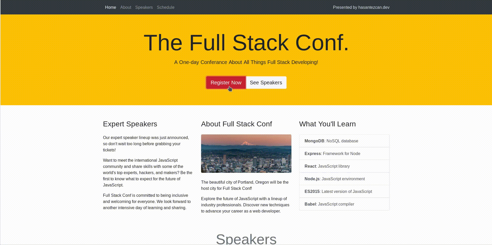

# The Full Stack Conf.
> Responsive one page web site

> Responsive Layouts with the Bootstrap Grid

- `Project goals: Imporve my bootsrap skils.`

<p align="center">
	
</p>

<p align="center">
	
</p>


<p align="center">
	
</p>

----
# Bootstrap 4 Notes

### `How to inculude Bootstrap files on my project?`

	- You can download all source files own your local

	- Use Bootstrap CDN[Content Delivery Network] (just work when you online!)

	- Use Package managers (npm, rubyGems, Composer, NuGet)

**Bootstrap will require a Sass compiler and Autoprefixer**


https://getbootstrap.com/docs/4.0/getting-started/download/

### `Theming Bootstrap`

	Customize Bootstrap 4 with our new built-in Sass variables for global style preferences for easy theming and component changes.

https://getbootstrap.com/docs/4.0/getting-started/theming/


**rem(root em):** A flexible CSS unit that's relative to the font size of the root element - usually the <html> element.

Cross browser compalabition

### `Bootstrap gird`

- Containers

- Rows

- Columns

### Auto Command Line Short Cut

	ctrl + "forwad /"

# Container

Keep in mind that containers are always required when using the Bootstrap grade!

But if you're creating a page without the grid system, you can still use containers to make your content fluid or responsive and centered in the page.


### `.container-fluid`

https://getbootstrap.com/docs/4.0/layout/overview/#containers

Use ".container-fluid" for a **full width** container, **spanning** the entire width of the viewport.

```html
<div class="container-fluid">
  ...
</div>
```

`NOTE:` When a Bootstrap container is fluid, there´s no max width set on the container, like there is when it´s a fixed width container.So that means your content will keep expanding to the width of the view port, no matter how wide it gets. And this can make your content **difficult to read** in **extra-large devices,like wide desktop screens.**


### `Responsive Design`

You can use the bootstrap grind system for making responsive your site.

You can set the site screen view step by step. (desktop[xl], tablet[md], phone[sm])

```hmtl
<div class= "col-lg col-xl-6">
```

in this example, this div will differnt look for lg screen and xl screen.  


### `Making Image to Responsive`

use this tag

class="img-fluid"

and also if you use this tag the image will seems like a little bit a rounded

class="rounded"

https://getbootstrap.com/docs/4.2/content/images/


### `Reordering - Order classes`

You can set div posion inorder to screen size.

https://getbootstrap.com/docs/4.2/layout/grid/#reorderingUse


### ml-auto
margin left auto this class silde the div en of the line.

### `target="_blank"`
this tag is open the link another tab!
```
	<a class="navbar-brand" href="http://hasantezcan.me" target="_blank">Presented by hasantezcan.me</a>
```

### `Change your Navbar Theme`

https://getbootstrap.com/docs/4.0/components/navbar/#color-schemes

example:

<nav class="navbar navbar-dark bg-dark">
  <!-- Navbar content -->
</nav>


### `Navbar Fixed Top`

- When you add this class your navbar it will stick in to the top your page.

		class="fixed-top"

### `Jumbotron`

It's a Information head title on site.

https://getbootstrap.com/docs/4.2/components/jumbotron/


### `Display property`

Quickly and responsively toggle the display value of components and more with our display utilities. Includes support for some of the more common values, as well as some extras for controlling display when printing.

https://getbootstrap.com/docs/4.2/utilities/display/

### `Buttons`

This links about, usage buttons in bootstrap 4.

https://getbootstrap.com/docs/4.2/components/buttons/

https://getbootstrap.com/docs/4.2/components/button-group/

### `Base Nav`

It's kind of a different from "navbar". We can call them primitive navbar. Base Nav most of use in bottom of site.

https://getbootstrap.com/docs/4.0/components/navs/#base-nav

### `Dropdown Menu`

Toggle contextual overlays for displaying lists of links and more with the Bootstrap dropdown plugin.

https://getbootstrap.com/docs/4.2/components/dropdowns/

You can change the directions of arrow. example:

	.dropup .dropright .dropleft

https://getbootstrap.com/docs/4.2/components/dropdowns/#directions

### `Cards`

The Cards use for present a image with desciprtsion.

https://getbootstrap.com/docs/4.0/components/card/

https://getbootstrap.com/docs/4.0/components/card/#image-caps

I did use in Bootstrap 4 Conf project card with this class

		<div class="col-md-6 col-lg-4">

This class make my site to responsive . When the look this site with large screen, you can see  4 post but your screen is smaller you can see 2 post.


### `List Group`

https://getbootstrap.com/docs/4.2/components/list-group/

https://getbootstrap.com/docs/4.2/components/list-group/#links-and-buttons

You can colorize your list those color classes.

https://getbootstrap.com/docs/4.0/components/list-group/#contextual-classes

You can user the badges item to make a notification bar or something like this.

https://getbootstrap.com/docs/4.2/components/list-group/#with-badges

https://getbootstrap.com/docs/4.2/components/badge/

### `Displaying a Modal Window`

The models like popups but the models contain some buttons or forms.

The models consists of two parts. First part is included models content. The second part is the trigger button to show models. Otherwise the you can not see the models without trigger button.

https://getbootstrap.com/docs/4.2/components/modal/

https://getbootstrap.com/docs/4.2/components/modal/#optional-sizes

### `Using ScrollSpy to Highlight Nav Links`

Automatically update Bootstrap navigation or list group components based on scroll position to indicate which link is currently active in the viewport.

This is the exemple:
https://getbootstrap.com/docs/4.2/components/scrollspy/#example-in-navbar

How we can use?

add this class in your body tag

	data-spy="scroll" data-target="#navbar-example"

https://getbootstrap.com/docs/4.0/components/scrollspy/#usage

If you want a change Scroll setting you can use those class. Add this class in body tag after what we have already added

	data-offset=""

https://getbootstrap.com/docs/4.0/components/scrollspy/#options

---

### `Unsolved Question`

https://teamtreehouse.com/community/why-does-the-dataoffset-not-work-the-same-as-scrolling-when-clicking-on-links-in-the-navbar

---

# `Form Groups and Form Controls`

https://getbootstrap.com/docs/4.2/content/reboot/#forms

The two form classes you'll likely use the most, are form-group and form-control.

You use the form-control class on textual input elements, like inputs, selects, and text area.

https://getbootstrap.com/docs/4.2/components/forms/#form-controls


The form-group class adds structure to your form. This class visually groups a form label and form control by separating the pair from other form controls.


https://getbootstrap.com/docs/4.2/components/forms/

https://getbootstrap.com/docs/4.0/components/forms/#form-groups

### `Screenreaders`

Use screenreader utilities to hide elements on all devices except screen readers.

- **`class="sr-only"`**

if I dont want to see the label in from you use it like this..

```html
<div class="form-group">
	<label class="sr-only" for="name">Name:</label>
	<input type="text" class="form-control" id="name">
</div>
```

you can't see "Name" tag anymore..

https://getbootstrap.com/docs/4.2/utilities/screenreaders/

### `Adding a Select Menu`

```html
<div class="form-group">
	<label for="role">Job Role:</label>
	<select class="custom-select form-control" id="role">
	  <option value="full stack js developer">Full Stack JavaScript Developer</option>
	  <option value="front end developer">Front End Developer</option>
	  <option value="back end developer">Back End Developer</option>
	  <option value="designer">Designer</option>
	  <option value="student">Student</option>
	</select>
</div>
```
class="custom-select form-control"  this class important to the all browsers being same look

### `Checkboxes`

https://getbootstrap.com/docs/4.3/components/forms/#checkboxes-and-radios

```html
<div class="form-check">
	<div class="form-check">
	  <input class="form-check-input" type="checkbox" value="" id="defaultCheck1">
	  <label class="form-check-label" for="defaultCheck1">JavaScript Frameworks/label>
	</div>
</div>
```

### `Alerts`

https://getbootstrap.com/docs/4.3/components/alerts/


### `Dismissing Alerts`

https://getbootstrap.com/docs/4.3/components/alerts/#dismissing

Bootstrap also provides an interactive alert box that closes when a user clicks the close icon.

The alert box displays above the form and when you click the close icon, the alert box disappears. And notice the fading effect.

	class="fade show" 
